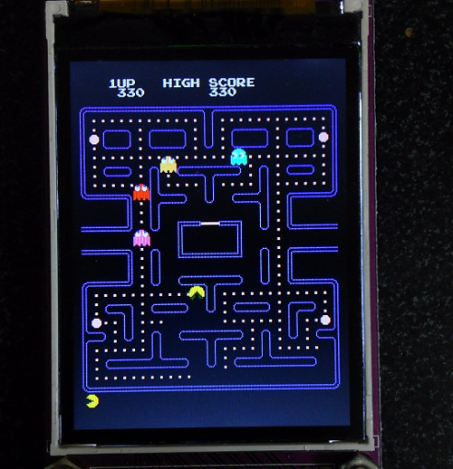
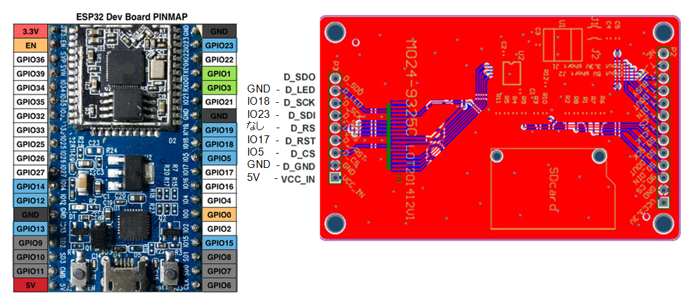
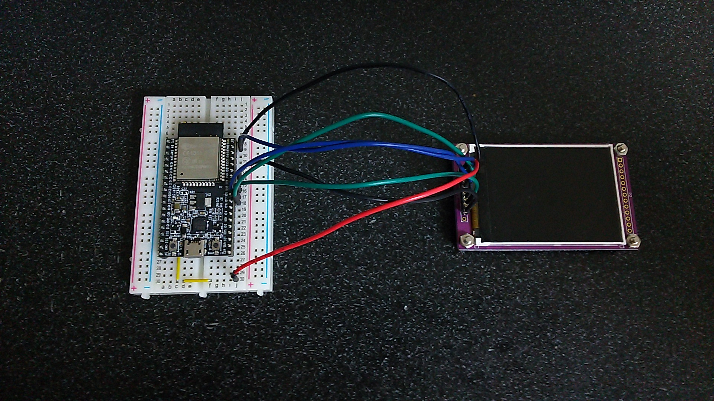

# esp32_ILI9328_Pacman
!!! NOTICE !!!

ILI9328 requires SPI_MODE3. But SPI_MODE2 and SPI_MODE3 configuration are inverted in my arduino-esp32 now.
If your arduino-esp32 has correct SPI configuration, you need to change to SPI_MODE3. 
See ili9328.cpp.

## Prepare
- [ESP32-DevKitC](http://akizukidenshi.com/catalog/g/gM-11819/) ESP32 : 秋月電子
- [M024C9328SPI](http://www.aitendo.com/product/10944) TFT color LCD : Aitendo

## Wiring
Jumper pad J1/J2 for setting power supply : J2 short (5V power supply)

## Development Environment
- [Arduino IDE](https://www.arduino.cc/en/main/software)
- [arduino-esp32](https://github.com/espressif/arduino-esp32)

## Coding reference
- [Pacman-Arduino-Due](https://github.com/DrNCXCortex/Pacman-Arduino-Due)

## Controller
You can use SerialPort or [WiFi TCP/UDP Controller](https://play.google.com/store/apps/details?id=udpcontroller.nomal&hl=ja) as the controller. Buttons UP, RIGHT, DOWN, and LEFT are each assigned on characters '8', '6', '2', and '4' in the both case of SerialPort and WiFi UDP. You can set configuration by loading "WiFi_UDP_Controller_config.txt" for WiFi TCP/UDP Controller.
